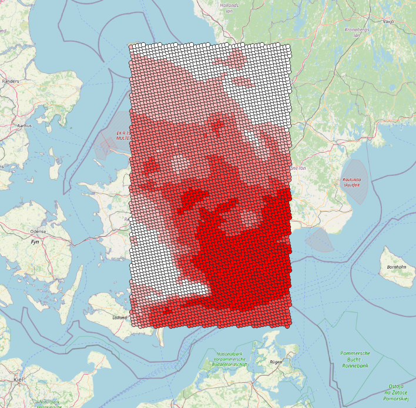
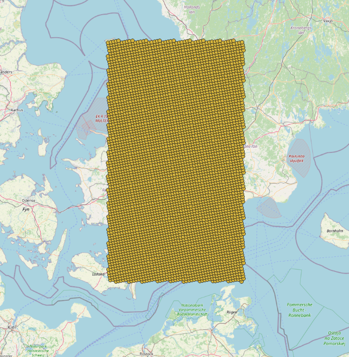
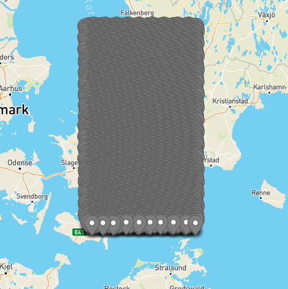

# grib_to_geojson
Example on how to use DMIs grib files

## Getting forecast data from DMI:

Start by getting access here: https://confluence.govcloud.dk/display/FDAPI/Getting+Started

Using the given API key download a grib file here:

https://dmigw.govcloud.dk/v1/forecastdata/collections/harmonie_nea_sf/items

See https://confluence.govcloud.dk/pages/viewpage.action?pageId=53086314 for information on how to build the exact query.
Generally find the features and then download these using the link in asset section:

      "collection": "harmonie_nea_sf",
      "id": "HARMONIE_NEA_SF_2022-09-05T090000Z_2022-09-07T120000Z.grib",
      "asset": {
        "data": {
          "href": "https://dmigw.govcloud.dk/v1/forecastdata/download/HARMONIE_NEA_SF_2022-09-05T090000Z_2022-09-07T120000Z.grib",
          "title": "Forecast file download resource",
          "type": "application/x-grib",
          "roles": [
            "data"
          ]
        }
      },

## Getting local parameter definitions

Some of the parameter names used in the grib files have local definitions must be looked up before making sense.

To do this get the local parameter definitions attached to this page: https://confluence.govcloud.dk/pages/viewpage.action?pageId=76153348 
and untar them somewhere on your system.

## Running the application

The GribToGeoJSON application shows how the grib files can be accessed and certain values can be extracted.
Application code filters on a bbox (11.560181, 54.714023, 13.563198, 56.717037) and for a certain parameter 
(Temperature at 2m above ground) and puts the matching values into a json file in OGC features format.
Change application code for other bboxes or parameters.

Execute it like so:

java GribToGeoJSON <gribfile>.grib <path_to_grib_definitions>\grib1\2.94.253.table <outputfile>.geojson

The generated file can be used with programs that understand geojson like geojson.io or QGIS.

Example from QGIS with color of features graduated by temperature:

Or without the coloring in QGIS:

Example in geojson.io: 

